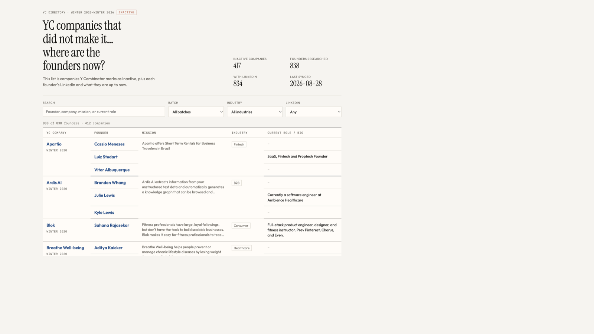

# failed-yc-founders

What do YC founders do after their startup fails?

This repo tracks **YC companies marked Inactive** from **Winter 2020 through Winter 2026**, then follows the founders (LinkedIn URLs and current roles when we can find them) in a small searchable dashboard.

**Live dashboard:** [shawncshen.github.io/failed-yc-founders/site/](https://shawncshen.github.io/failed-yc-founders/site/)



## What counts as failed

YC’s public directory uses four statuses: `Active`, `Inactive`, `Acquired`, `Public`.

We only include companies where:

- `status === "Inactive"` (YC still lists them as inactive, not acquired or public)
- batch is Winter 2020 … Winter 2026 (including Summer / Fall / Spring batches in that window)

`Acquired` and `Public` are excluded on purpose. Companies that left YC’s directory while still operating are also excluded: “not on YC anymore” is not the same as “the company failed.”

## How to run the dashboard

From the repo root:

```bash
python3 -m http.server
```

Then open [http://127.0.0.1:8000/site/](http://127.0.0.1:8000/site/).

Serve from the **repo root** (not `site/`), so the page can load `../data/companies.json` and `../data/founders.json`.

The page is one table: YC company + batch, founder (LinkedIn when known), mission, industry, and current role.

## Refresh the data

```bash
# 1) Pull the latest Inactive census from the YC directory mirror
python3 scripts/sync_yc.py

# 2) Enrich founders (YC company pages + LinkdAPI for missing LinkedIn)
cp .env.example .env
# put LINKDAPI_API_KEY=... in .env
python3 scripts/enrich_founders.py
```

Useful `enrich_founders.py` flags:

| Flag | Purpose |
| --- | --- |
| `--limit N` | Process only the first N companies |
| `--skip-linkdapi` | YC pages only |
| `--with-headlines` | Also fetch LinkedIn headlines when a URL already exists |
| `--force` | Rebuild cached founder rows |

Never commit `.env`. Use `.env.example` as the template.

A weekly GitHub Action (`.github/workflows/sync.yml`) can refresh `data/companies.json` on a schedule.

## Data

| File | Contents |
| --- | --- |
| `data/companies.json` | Inactive companies in the batch window |
| `data/companies.csv` | Same census as CSV |
| `data/founders.json` | Founders with LinkedIn + current bio/headline |

**Sources**

1. [yc-oss API](https://yc-oss.github.io/api/companies/all.json): unofficial daily mirror of YC’s public directory
2. YC company pages: founder names, LinkedIn, and company mission text when listed
3. [LinkdAPI](https://linkdapi.com/): fill LinkedIn gaps (`LINKDAPI_API_KEY`)

## GitHub Pages

Published from the `main` branch root:

[https://shawncshen.github.io/failed-yc-founders/site/](https://shawncshen.github.io/failed-yc-founders/site/)
